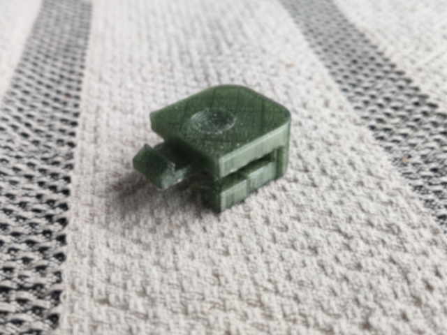
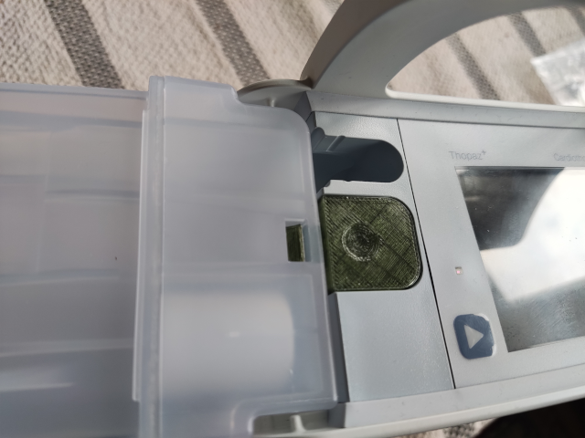
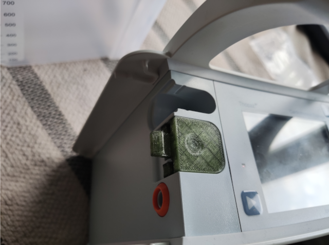
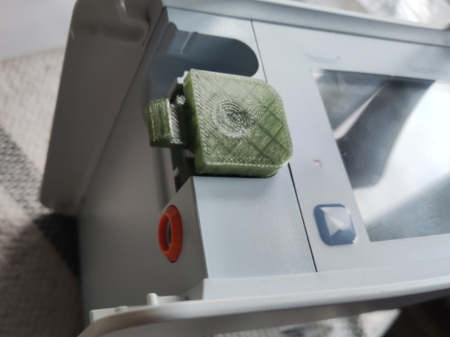

# Thopaz Canister Button
Thopaz+ Canister lock button

**Attention:** This design is **NOT** for practical application. It is intended for **lab test purposes only**.

## 3D Printing Setup
- **Layer Height:** 0.2mm (strength Profile)
- **Support Type:** Hybrid Tree Support
- **Filament Material:** PETG

## Instructions for Button Removal
To remove the button from the pump:
1. Use your fingertips to grip the front bottom part of the button.
2. Gently pull it outward.
3. The button should easily pop out.
## Images

### Button Design

### Button attched

### Button Removal Process
1. Grip the button:

    
2. Pull outward:

    
